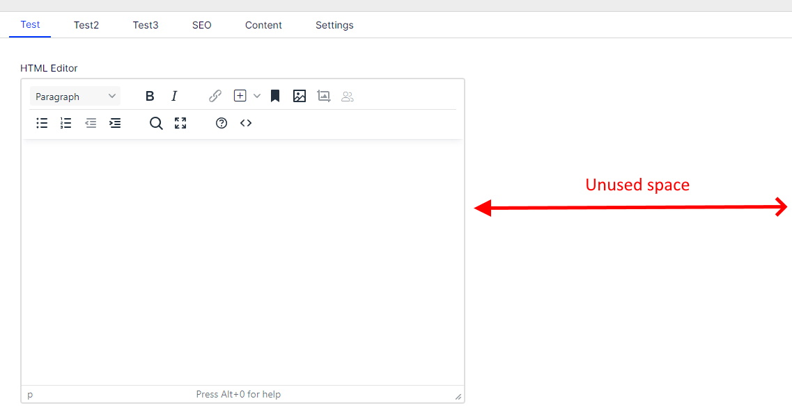
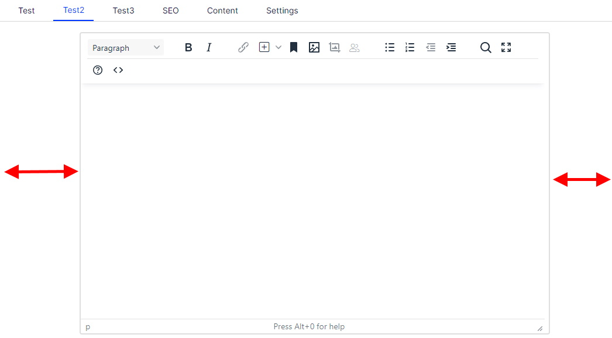
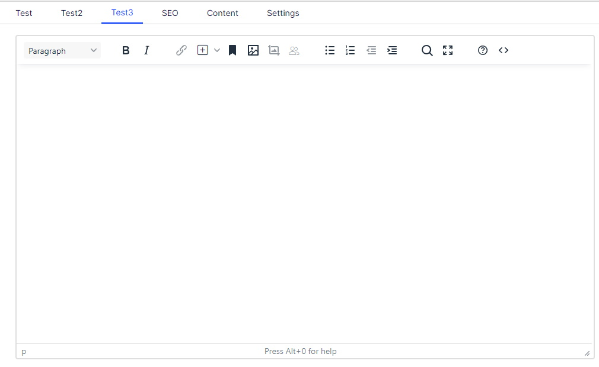

# ExtendedCms.TinyMceEnhancements

ExtendedCms.TinyMceEnhancements contains set of improvements for Optimizely TinyMCE integration.


---

Table of contents:
* [Managing image dimensions attributes](#managing-image-dimensions)
* [Adding custom attributes](#adding-custom-attributes)
* [Set ALT text](#set-alt-text)
* [Full Width TinyMCE editor](#full-width-tinymce-editor)
* [Configuring specific features](#configuring-specific-features)

## Getting Started

To get started, you need to install ExtendedCms.TinyMceEnhancements package from EPiServer's [NuGet feed](https://nuget.episerver.com/package/?id=ExtendedCms.TinyMceEnhancements).

```csharp
public void ConfigureServices(IServiceCollection services)
{
    //...

    services.Configure<TinyMceEnhancementsOptions>(uiOptions =>
    {
        uiOptions.ImageAttributes = new ()
        {
            StaticAttributes = new[]
            {
                new ImageQueryStringAttribute
                {
                    Name = "format",
                    Value = "webp"
                }
            },
            ImageSizeSettings = new ()
            {
                WidthName = "width",
                HeightName = "height"
            }
        };
        uiOptions.ImageRestrictions = new ()
        {
            MaxWidth = 300,
            MaxHeight = 200,
            KeepRatio = true
        };
        uiOptions.ImageAltTextSettings = new ()
        {
            ImageAltAttributes = new[] { "copyright" }
        };
    });
    
    services.......
        .AddTinyMce()
        .AddTinyMceEnhancements() // Turn on TinyMCEEnhancements addon

   // ...
}
````

## Managing image dimensions

When adding an image to the HTML editor, TinyMCE automatically sets the height and width in attributes.

For example:
````

````

This means that the image is resized on the client, but the browser still returns the full-size image. In many cases, we would like to return the image at the size that is currently displayed on the screen.


To solve this problem, you can use one of the popular plug-ins, such as [Baaijte.Optimizely.ImageSharp.Web](https://github.com/vnbaaij/Baaijte.Optimizely.ImageSharp.Web). With this plugin, after entering the width and height in querystring, the image in given dimensions is returned from the server.

Unfortunately TinyMCE only adds height and width as attributes. Using **TinyMceEnhancements** it is possible to change the way the editor works. To set the names of the querystring parameters used for height and width use `ImageSizeSettings` options:

````csharp
services.Configure<TinyMceEnhancementsOptions>(options =>
{
    options.ImageAttributes = new ()
    {
        ImageSizeSettings = new ()
        {
            WidthName = "width",
            HeightName = "height"
        }
    };
}
````

From now on, when adding an image to the editor or changing image size, the querystring will also be changed:

````

````

Then Baaijte.Optimizely.ImageSharp.Web (or another plugin) will return the resized image.

### Limiting image size

The plugin additionally allows you to limit the maximum size of images. This will prevent your images from becoming too large.
To configure the maximum size of images, you need to configure the `ImageRestrictions` option:

````csharp
public void ConfigureServices(IServiceCollection services)
{
    services.Configure<TinyMceEnhancementsOptions>(uiOptions =>
    {
        uiOptions.ImageRestrictions = new ()
        {
            MaxWidth = 300,
            MaxHeight = 200,
            KeepRatio = true
        };
    });
}
````

## Adding custom attributes

Some plugins require additional query string parameters to be added. E.g. Baaijte.Optimizely.ImageSharp.Web will return images in webp format if the querystring contains `format=webp`.

To add static attributes to an image querystring using TinyMceEnhancements, configure `StaticAttributes`:


````csharp
public void ConfigureServices(IServiceCollection services)
{
    //...

    services.Configure<TinyMceEnhancementsOptions>(uiOptions =>.
    {
        uiOptions.ImageAttributes = new ()
        {
            StaticAttributes = new[]
            {
                new ImageQueryStringAttribute
                {
                    Name = "format",
                    Value = "webp"
                }
            }
        };
    });

   // ...
}
````

Using the code above, a `format=webp` querystring will be added to each image:

````

````

## Set ALT text

Alt text attribute is very important, because it makes images more accessible for both people and search engines.

Of course TinyMCE allows to set ALT attribute, but it's not mandatory.

The TinyMceEnhancements plugin can be configured to display a dialog box to enter ALT text when adding an image.

In addition, you can configure the default ALT text completed when the dialog is displayed. To add a default ALT text, configure the `ImageAltTextSettings` option:

````csharp
public void ConfigureServices(IServiceCollection services)
{
    services.Configure<TinyMceEnhancementsOptions>(uiOptions =>
    {
        uiOptions.ImageAltTextSettings = new ()
        {
            ImageAltAttributes = new[] { "copyright" }
        };
    });
}
````

When you add an image to the editor, the ALT text dialog with hint will be displayed.


## Full Width TinyMCE editor

All Optimizely properties have very similar width. This width is suitable for fields such as ContentReference or short text, but often the TinyMCE property used to store the main content of an article contains much more text and we would like the field to be wider.



Using TinyMceEnhancements we can make the TinyMCE field larger. The assumption is that the HTML editor will be the only property on the tab.
To increase the width of the editor, the `FullSizeTinyMce` attribute must be added to the property model. The attribute has two configuration options:

### Centered

The TinyMCE editor will be centred

```csharp
[Display(Name = "HTML Editor 2", GroupName = "Test2", Order = 20)]
[FullSizeTinyMce(EditorWidth = WidthType.Centered)]
public virtual XhtmlString HtmlEditorCentered { get; set; }
```



### FullWidth

The TinyMCE editor will be stretched to the full width of the editing area

```csharp
[Display(Name = "HTML Editor 3", GroupName = "Test3", Order = 20)]
[FullSizeTinyMce(EditorWidth = WidthType.Full)]
public virtual XhtmlString HtmlEditorFullWidth { get; set; }
```


## Configuring specific features

By default managing both image size and ALT text are enabled. It's configurable using `AddTinyMceEnhancements` method:

```csharp
public void ConfigureServices(IServiceCollection services)
{
    //...

    var configureImageAttributes = false;
    var configureImageAlt = true;
    services.......
        .AddTinyMce()
        .AddTinyMceEnhancements(configureImageAttributes, configureImageAlt) // Turn on TinyMCEEnhancements addon

   // ...
}
````

You can also turn it on only for specific TinyMce instances, for example:

````csharp
public static class ServiceCollectionExtensions
{
    public static IServiceCollection CustomizeTinyMce(this IServiceCollection services)
    {
        services.Configure<TinyMceConfiguration>(config =>
        {
            config.For<ArticlePage>(t => t.SharedBody)
              .ConfigureImagePlugin()
              .ConfigureImageAltPlugin();
	}
    }
}
````


