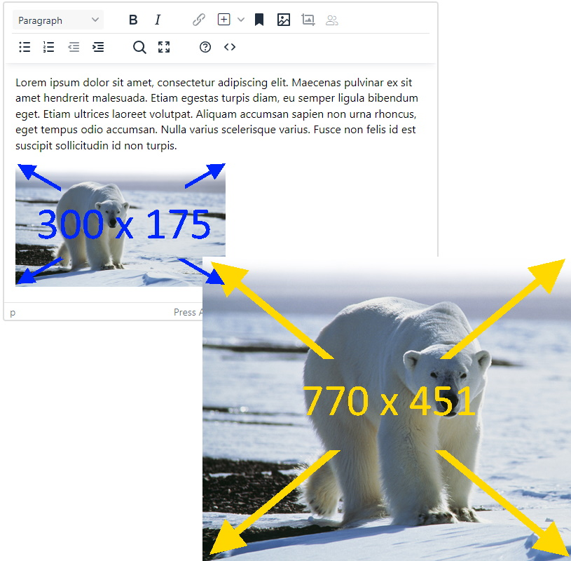
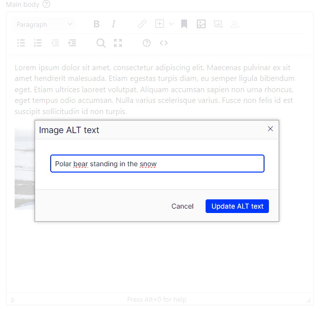

# ExtendedCms.TinyMceEnhancements

ExtendedCms.TinyMceEnhancements contains set of enhancements for Optimizely TinyMCE integration.


* [Managing image dimensions attributes](#managing-image-dimensions)
* [Adding custom attributes](#adding-custom-attributes)
* [Set ALT text](#set-alt-text)

## installation


```csharp
public void ConfigureServices(IServiceCollection services)
{
    //...

    services.Configure<TinyMceEnhancementsOptions>(uiOptions =>
    {
        uiOptions.ImageAttributes = new ()
        {
            StaticAttributes = new[]
            {
                new ImageQueryStringAttribute
                {
                    Name = "format",
                    Value = "webp"
                }
            },
            ImageSizeSettings = new ()
            {
                WidthName = "width",
                HeightName = "height"
            }
        };
        uiOptions.ImageRestrictions = new ()
        {
            MaxWidth = 300,
            MaxHeight = 200,
            KeepRatio = true
        };
        uiOptions.ImageAltTextSettings = new ()
        {
            ImageAltAttributes = new[] { "copyright" }
        };
    });
    
    services.......
        .AddTinyMce()
        .AddTinyMceEnhancements() // 

   // ...
}
```

## Managing image dimensions



TODO

## Adding custom attributes

TODO

## Set ALT text



TODO